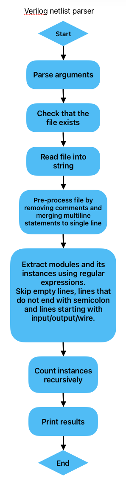
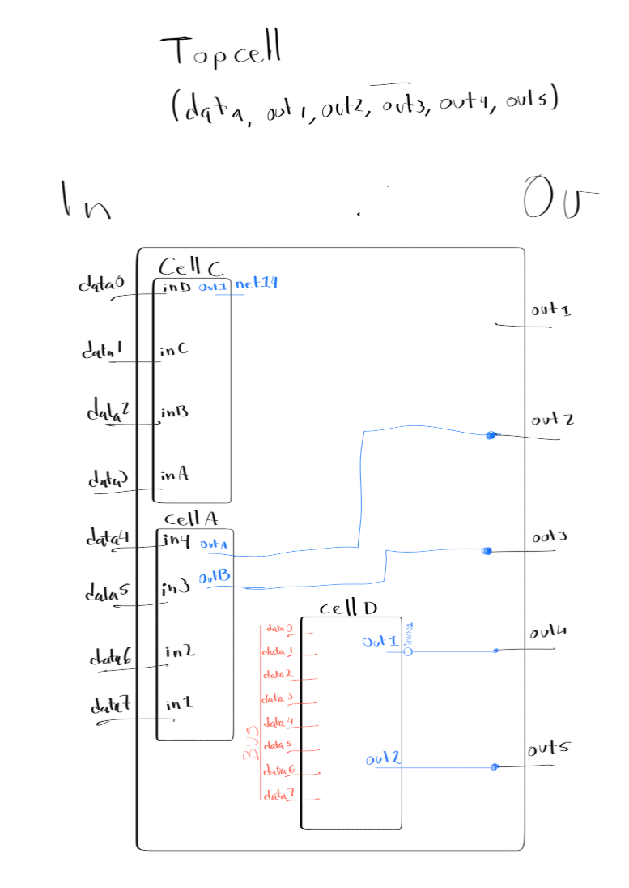
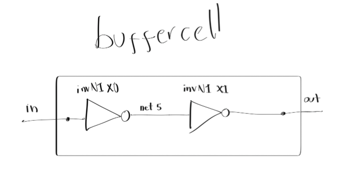
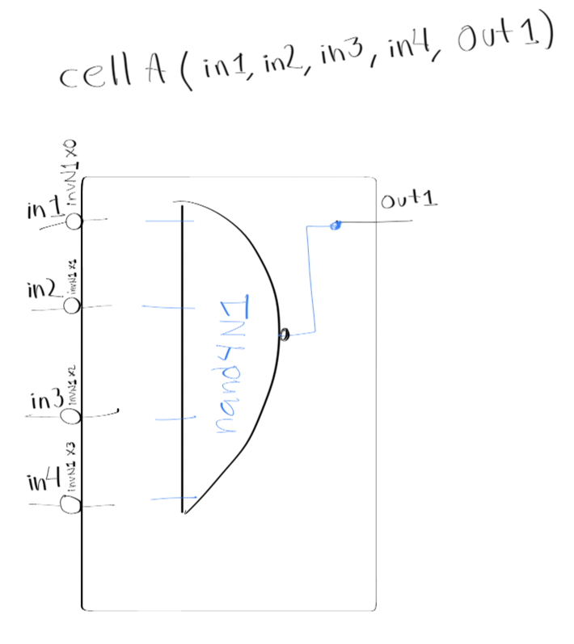
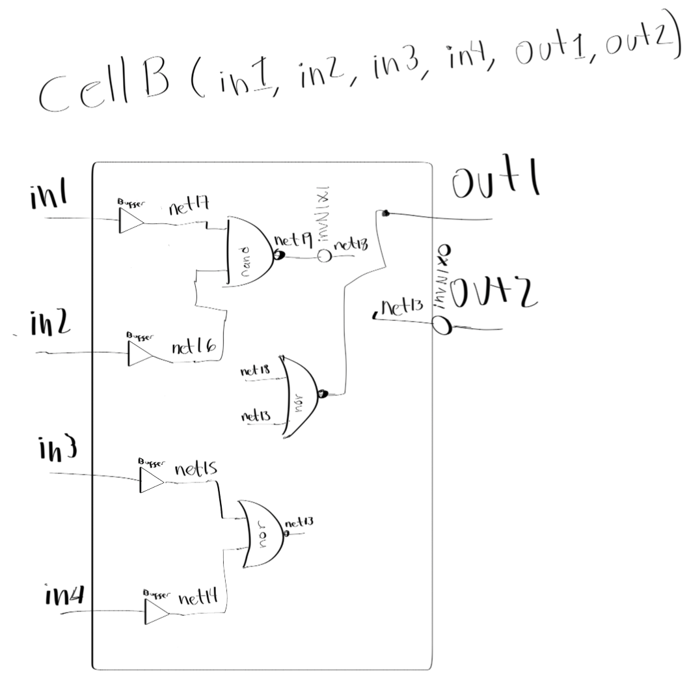
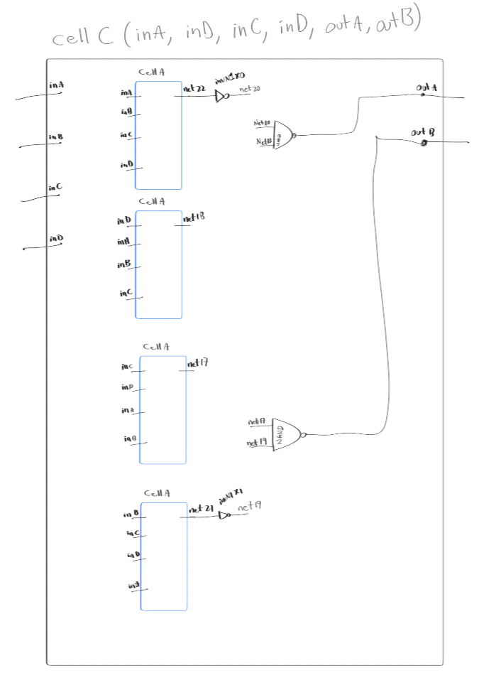
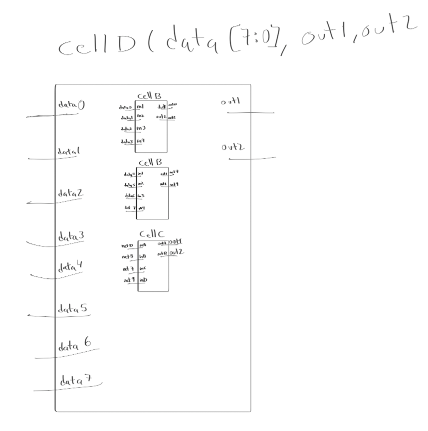

# Verilog netlist parser 

## Python script that takes a verilog netlist as input to extract the modules and the instances of logical elements. 

## Use example:

    python3 netlist-parser.py <verilog_netlist_file>

Enable verbosity: 

    python3 netlist-parser.py <verilog_netlist_file> [--verbose yes/no]    

### Block diagram/Flowchart:

### Script output example: 

#### With provided netlist:

    Module: TopCell
    cellA : 9 placements
    invN1 : 61 placements
    nand4N1 : 9 placements
    cellC : 2 placements
    nand2N1 : 6 placements
    cellD : 1 placements
    cellB : 2 placements
    bufferCell : 8 placements
    nor2N1 : 4 placements

    Module: bufferCell
    invN1 : 2 placements

    Module: cellA
    invN1 : 4 placements
    nand4N1 : 1 placements

    Module: cellB
    bufferCell : 4 placements
    invN1 : 10 placements
    nand2N1 : 1 placements
    nor2N1 : 2 placements

    Module: cellC
    cellA : 4 placements
    invN1 : 18 placements
    nand4N1 : 4 placements
    nand2N1 : 2 placements
    Module: cellD
    cellB : 2 placements
    bufferCell : 8 placements
    invN1 : 38 placements
    nand2N1 : 4 placements
    nor2N1 : 4 placements
    cellC : 1 placements
    cellA : 4 placements
    nand4N1 : 4 placements

#### With modified netlist 

    Module: TopCell
    bufferCell : 48 placements
    invN1 : 141 placements
    cellA : 9 placements
    nand4N1 : 9 placements
    cellC : 2 placements
    nand2N1 : 6 placements
    cellD : 1 placements
    cellB : 2 placements
    nor2N1 : 4 placements

    Module: bufferCell
    invN1 : 2 placements

    Module: cellA
    bufferCell : 4 placements
    invN1 : 12 placements
    nand4N1 : 1 placements

    Module: cellB
    bufferCell : 4 placements
    invN1 : 10 placements
    nand2N1 : 1 placements
    nor2N1 : 2 placements

    Module: cellC
    cellA : 4 placements
    bufferCell : 16 placements
    invN1 : 50 placements
    nand4N1 : 4 placements
    nand2N1 : 2 placements

    Module: cellD
    cellB : 2 placements
    bufferCell : 24 placements
    invN1 : 70 placements
    nand2N1 : 4 placements
    nor2N1 : 4 placements
    cellC : 1 placements
    cellA : 4 placements
    nand4N1 : 4 placements

### To do 

Do not skip input, output and wire as these might be used in the future. 
Improve the storing of these values.  Think about a diretory of directories. 
Improve comments on code. 
Improve the architecture for the script to be able to handle netlist files with a high number of modules/instances. 
Improve the file validation, does the file exists, is the file a valid verilog netlist file?

### Netlist graphical represenation drawn by hand:

To understand the netlist I hand drawn its contents. 

### TopCell 

### Buffer cell

### cellA

### cellB

### cellC 

### cellD 

